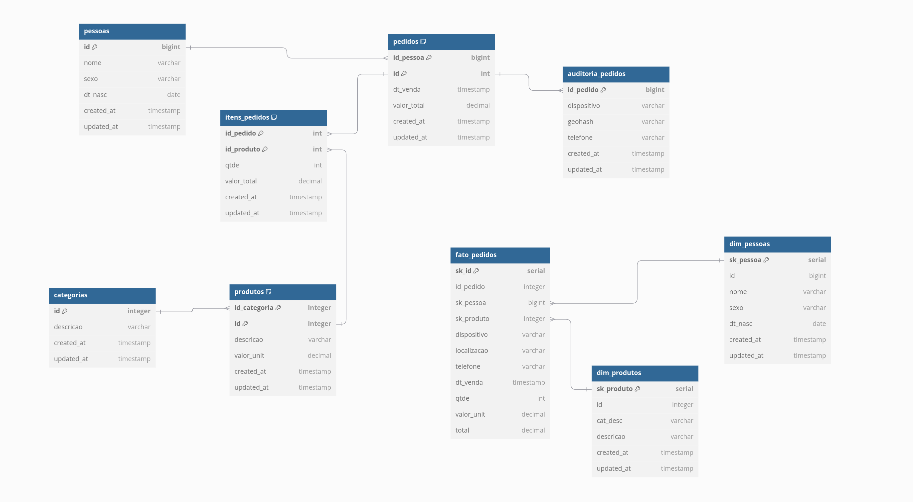

# Jornada Engenharia de dados


Bem-vindo ao Mapa do Engenheiro de Dados, um programa prático e desafiador que recria situações reais enfrentadas por profissionais da área de dados. Neste módulo, você será guiado na construção de uma arquitetura robusta e paralela, que simula um ambiente dinâmico e ininterrupto, tal como ocorre no mercado.

Ao longo do curso, você aprenderá os fundamentos e aplicará técnicas avançadas de modelagem de dados, desenvolvendo consultas transacionais e analíticas em SQL, alcançando um nível de maestria.

# Liga Sudoers - Arquitetura de Big Data

Este repositório visa mostrar o processo trandicional de geração de dados em ambiente transacionais e ETL para ambiente analiticos. Ao subir os containeres serão:
  * 1 ambiente PostgreSQL com modelagem transacional, usando 3 forma normal (3FN)
  * 1 ambiente PostgreSQL com modelagem dimensional. usando star schema. 
  * 1 ambiente com Debezium para CDC.
  * 1 ambiente com Kafka para Streaming.
  * 1 ambiente com Zookeeper para apoio aos serviços.
  * 1 ambiente com Airflow para orquestração de pipelines.
  * 1 ambiente com DBT para Transformação de dados.
  * 1 ambiente com Spark para processamento distribuído.
  * 1 ambiente com MinIO para armazenamento distribuído.
  
  
  Dentro do repositório teremos os scripts em Python que irão simular a entrada de dados:
  * liga_sudoers_historico.py - Gera dados históricos com pedidos com data retroativas, não gera novos produtos nem novos clientes. Gera 1% de dados que serão considerados fraude para treinamento do modelo. 
  * liga_sudoers_streaming.py - Gera dados streamind com pedidos com data atual, gera novos clientes e registra novos pedidos. Gera 5% de dados que serão considerados fraude para treinamento do modelo. 

  [Vídeo Explicativo](https://youtu.be/Kc-mmy8eMcA)


## Perfil e responsabilidades

Perfis de profissionais e suas responsabilidades no dia a dia dos processos mostrados.
  - [Data Architect](../docs/perfis.md#data-architect) (Arquiteto de Dados) 
  - [Data Engineer](../docs/perfis.md#data-engineer)(Engenheiro de Dados)
  - [Platform Engineer](../docs/perfis.md#plataform-engineer) (Engenheiro de Plataforma)  
  - [Data Administrator](../docs/perfis.md#data-administrator) (Administrador de Dados)
  - [DevOps Engineer](../docs/perfis.md#devops-engineer) (Engenheiro de DevOps)


# Iniciando DBT

## Preparando o ambiente



### Preparando tabelas para DBT usando DeltaTable
Logando no container para configurar os buckets.

```bash
docker exec -it minio sh
```

Adicionar o alias para acessar ao ambiente. 
```bash
mc alias set local http://minio:9000 sudoers123 sudoers1234
```

Criar os buckets que irão servir para armazenar os dados. Criaremos as camadas raw, trusted e refined para o Data Lake.
```bash
mc mb local/bronze
mc mb local/silver
mc mb local/gold
```

### Sete o bucket para que sejam públicos.
```bash
mc anonymous set public local/bronze
mc anonymous set public local/silver
mc anonymous set public local/gold
```

### Pegando os dados do Log de Transação (WAL)

```bash
docker exec -it spark bash
```

```bash
spark-sql
```

Vamos criar nossa arquitetura medalhão e já fazer a federação do nosso ambiente OLTP
```bash
spark-sql (default)> CREATE SCHEMA bronze;

spark-sql (default)> CREATE SCHEMA silver;

spark-sql (default)> CREATE SCHEMA gold;

```

```bash
spark-sql (default)> CREATE SCHEMA oltp;
spark-sql (default)> USE oltp;
spark-sql (oltp)> CREATE TABLE pessoas
USING jdbc
OPTIONS (
    url "jdbc:postgresql://postgres_oltp:5432/liga_sudoers",
    driver "org.postgresql.Driver",
    dbtable "pessoas",
    user "sudoers",
    password "sudoers"
);

spark-sql (oltp)> CREATE TABLE categorias
USING jdbc
OPTIONS (
    url "jdbc:postgresql://postgres_oltp:5432/liga_sudoers",
    driver "org.postgresql.Driver",
    dbtable "categorias",
    user "sudoers",
    password "sudoers"
);

spark-sql (oltp)> CREATE TABLE produtos
USING jdbc
OPTIONS (
    url "jdbc:postgresql://postgres_oltp:5432/liga_sudoers",
    driver "org.postgresql.Driver",
    dbtable "produtos",
    user "sudoers",
    password "sudoers"
);

spark-sql (oltp)> CREATE TABLE pedidos
USING jdbc
OPTIONS (
    url "jdbc:postgresql://postgres_oltp:5432/liga_sudoers",
    driver "org.postgresql.Driver",
    dbtable "pedidos",
    user "sudoers",
    password "sudoers"
);

spark-sql (oltp)> CREATE TABLE itens_pedidos
USING jdbc
OPTIONS (
    url "jdbc:postgresql://postgres_oltp:5432/liga_sudoers",
    driver "org.postgresql.Driver",
    dbtable "itens_pedidos",
    user "sudoers",
    password "sudoers"
);

spark-sql (oltp)> CREATE TABLE auditoria_pedidos
USING jdbc
OPTIONS (
    url "jdbc:postgresql://postgres_oltp:5432/liga_sudoers",
    driver "org.postgresql.Driver",
    dbtable "auditoria_pedidos",
    user "sudoers",
    password "sudoers"
);
```

## Instalando o DBT
```bash 
pip install --upgrade pip

pip install dbt-spark dbt-core
pip install dbt-spark[session]
export PATH=~/.local/bin:$PATH

```


## Ative a máquina do dbt
```bash
dbt_project/
├── dbt_project.yml
├── logs
│   └── dbt.log
├── models
│   ├── bronze
│   │   ├── auditoria_pedidos.sql
│   │   ├── categorias.sql
│   │   ├── itens_pedidos.sql
│   │   ├── pedidos.sql
│   │   ├── pessoas.sql
│   │   └── produtos.sql
│   ├── gold
│   │   └── itens_by_person.sql
│   └── silver
│       ├── dim_pessoas.sql
│       ├── dim_produtos.sql
│       └── fato_pedidos.sql
├── profiles.yml
├── README.md
```

### Rodando o DBT 
```bash
cd /opt/bitnami/spark

DBT_SCHEMA=bronze dbt run --models bronze --project-dir /usr/app/ --profiles-dir /usr/app/

DBT_SCHEMA=silver dbt run --models silver --project-dir /usr/app/ --profiles-dir /usr/app/

DBT_SCHEMA=gold dbt run --models gold --project-dir /usr/app/ --profiles-dir /usr/app/
```


### Melhorando a performance das tabelas (opcional)
```bash
spark-sql
```

```bash
spark-sql (default)> OPTIMIZE bronze.pedidos ZORDER BY (id_pessoa);
spark-sql (default)> OPTIMIZE bronze.itens_pedidos ZORDER BY (id_pedido);
spark-sql (default)> OPTIMIZE bronze.auditoria_pedidos ZORDER BY (id_pedido);
spark-sql (default)> OPTIMIZE silver.fato_pedidos ZORDER BY (id_pessoa);
spark-sql (default)> OPTIMIZE gold.itens_by_person ZORDER BY (id_pedido);
```


### Gerar documentação do fluxo

```bash
dbt docs generate --project-dir /usr/app/ --profiles-dir /usr/app/

dbt docs serve --project-dir /usr/app/ --profiles-dir /usr/app/ --port 8085 --host 0.0.0.0
```


# Continue no airflow_dags/README.md